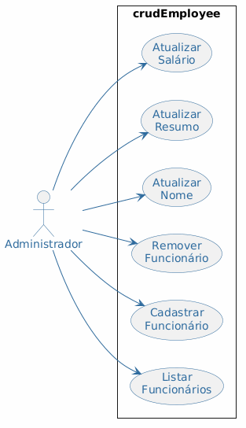

# Diagrama de Casos de Uso — crudEmployee

## Visão Geral

O diagrama abaixo mapeia o escopo funcional do sistema **crudEmployee**, identificando as interações entre o ator **Administrador** e as funcionalidades disponíveis na API REST de gerenciamento de funcionários.

## Diagrama

## Atores

| Ator | Descrição |
|---|---|
| **Administrador** | Responsável por gerenciar o cadastro de funcionários, podendo criar, listar, editar e excluir registros. Representa também o Desenvolvedor e o Analista de RH no contexto do sistema. |

## Casos de Uso

| ID | Caso de Uso | Descrição |
|---|---|---|
| UC01 | **Listar Funcionários** | Retorna todos os funcionários cadastrados no sistema. |
| UC02 | **Cadastrar Funcionário** | Cria um novo registro de funcionário com nome, salário e resumo profissional. |
| UC03 | **Remover Funcionário** | Exclui um funcionário existente pelo seu identificador único. |
| UC04 | **Atualizar Nome** | Altera o nome de um funcionário específico. |
| UC05 | **Atualizar Resumo** | Atualiza o resumo profissional de um funcionário. |
| UC06 | **Atualizar Salário** | Modifica o salário de um funcionário. |

## Relacionamentos

- Todos os casos de uso são associados diretamente ao ator **Administrador**, que pode acioná-los individualmente conforme a necessidade.
- Não há relações de `<<include>>` ou `<<extend>>` entre os casos de uso, pois cada operação CRUD é independente e autocontida.
