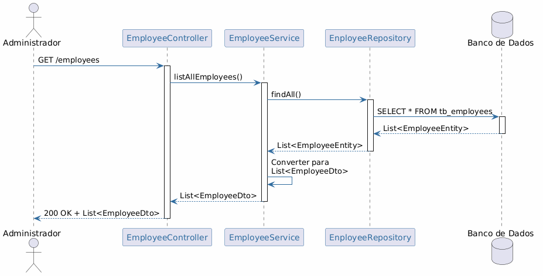
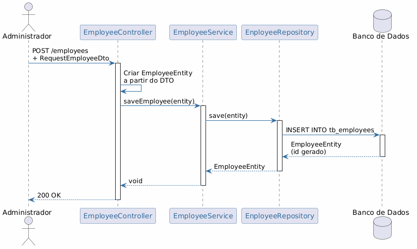
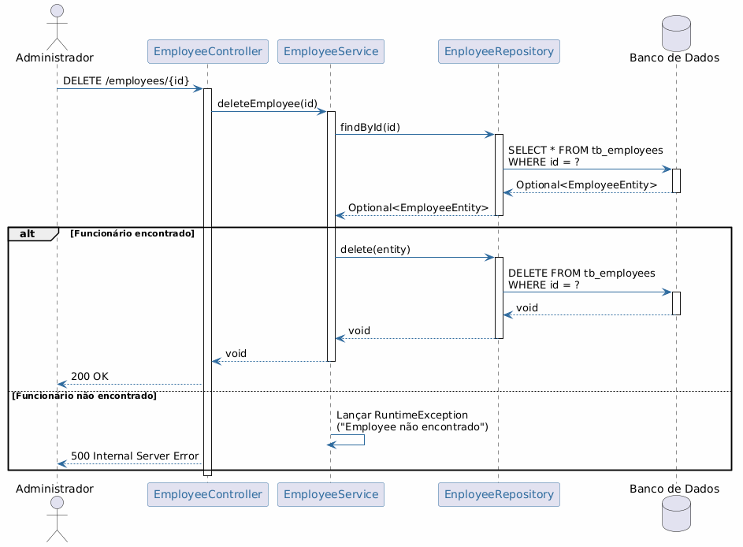
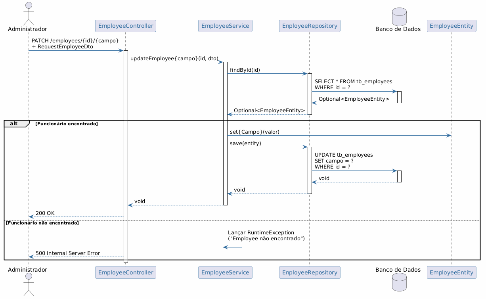

# Diagramas de Sequência — crudEmployee

Este documento contém os diagramas de sequência do sistema, representando a troca de mensagens entre os objetos envolvidos em cada operação CRUD.

---

## Listar Funcionários (US01)

Fluxo de listagem de todos os funcionários cadastrados.

---

## Cadastrar Funcionário (US02)

Fluxo de cadastro de um novo funcionário.

---

## Remover Funcionário (US03)

Fluxo de remoção de um funcionário, incluindo tratamento de erro caso o id não exista.

---

## Atualizar Funcionário (US04, US05, US06)

Fluxo genérico de atualização de campos do funcionário (nome, resumo ou salário). Inclui tratamento de erro caso o id não exista.

---

## Resumo dos Relacionamentos

| Diagrama | Caso de Uso | User Story | Operação |
|---|---|---|---|
| Listar | UC01 | US01 | `GET /employees` |
| Cadastrar | UC02 | US02 | `POST /employees` |
| Remover | UC03 | US03 | `DELETE /employees/{id}` |
| Atualizar | UC04–UC06 | US04–US06 | `PATCH /employees/{id}/{campo}` |

## Atores e Participantes

| Participante | Descrição |
|---|---|
| **Administrador** | Ator do sistema que aciona as operações |
| **EmployeeController** | Controlador REST que recebe as requisições HTTP |
| **EmployeeService** | Camada de serviço com as regras de negócio |
| **EnployeeRepository** | Interface JPA que persiste e recupera os dados |
| **Banco de Dados** | Banco H2 (test) ou PostgreSQL (dev) |
