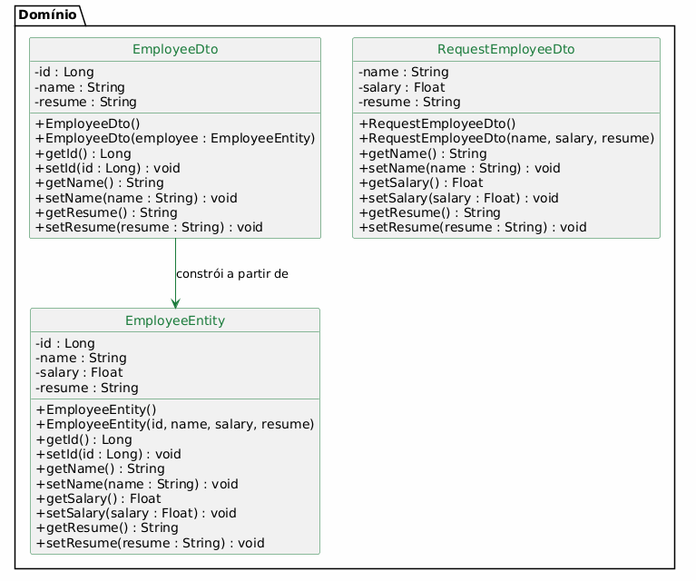
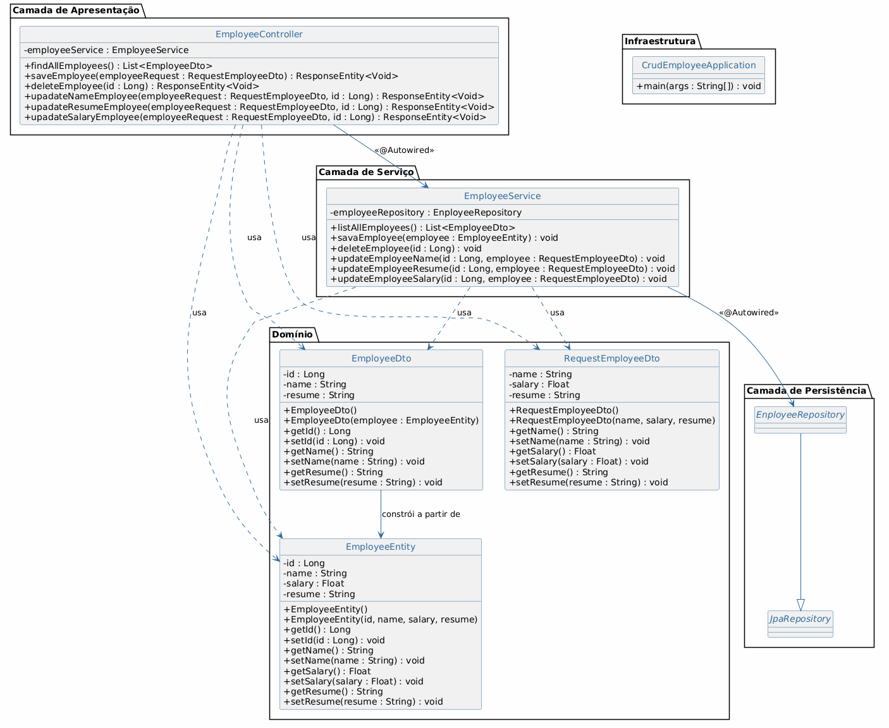

# Diagramas de Classes — crudEmployee

Este documento contém os diagramas de classes do sistema, divididos em duas visões: **Domínio** (apenas classes de negócio) e **Geral** (todas as classes do sistema com suas relações).

---

## Diagrama de Classes de Domínio

Representa exclusivamente as classes do domínio do problema: entidade JPA e DTOs de request/response.

### Classes

| Classe | Descrição |
|---|---|
| **EmployeeEntity** | Entidade JPA mapeada para a tabela `tb_employees`. Contém os atributos: id, name, salary e resume. |
| **EmployeeDto** | DTO de resposta utilizado para exibir funcionários na listagem. Oculta o campo `salary` por segurança. Possui construtor que recebe um `EmployeeEntity`. |
| **RequestEmployeeDto** | DTO de requisição utilizado para receber dados de criação e atualização de funcionários. Contém: name, salary e resume. |

### Relacionamentos

| Origem | Destino | Tipo | Descrição |
|---|---|---|---|
| `EmployeeDto` | `EmployeeEntity` | Dependência | `EmployeeDto` possui um construtor que recebe `EmployeeEntity` para conversão |

---

## Diagrama de Classes Geral

Representa todas as classes do sistema Spring Boot, organizadas por camadas, incluindo as relações de injeção de dependência e herança.

### Camadas

| Camada | Classes | Descrição |
|---|---|---|
| **Infraestrutura** | `CrudEmployeeApplication` | Classe principal com `@SpringBootApplication`. Ponto de entrada da aplicação. |
| **Apresentação** | `EmployeeController` | Controlador REST com `@RestController` e `@RequestMapping("/employees")`. Expõe os endpoints da API. |
| **Serviço** | `EmployeeService` | Classe de negócio com `@Service`. Orquestra as operações CRUD. |
| **Persistência** | `EnployeeRepository`, `JpaRepository` | Interface que estende `JpaRepository` do Spring Data JPA, herdando métodos prontos como `findAll()`, `save()`, `findById()`, `delete()`. |
| **Domínio** | `EmployeeEntity`, `EmployeeDto`, `RequestEmployeeDto` | Classes de domínio do negócio. |

### Relacionamentos

| Origem | Destino | Tipo | Descrição |
|---|---|---|---|
| `EmployeeController` | `EmployeeService` | Associação (`@Autowired`) | Injeção de dependência do service no controller |
| `EmployeeService` | `EnployeeRepository` | Associação (`@Autowired`) | Injeção de dependência do repository no service |
| `EnployeeRepository` | `JpaRepository` | Herança (interface) | A interface herda os métodos CRUD prontos do Spring Data |
| `EmployeeController` | `EmployeeDto` | Dependência | Usado como retorno dos métodos |
| `EmployeeController` | `RequestEmployeeDto` | Dependência | Usado como parâmetro dos métodos |
| `EmployeeController` | `EmployeeEntity` | Dependência | Usado para criar entidades a partir do request |
| `EmployeeService` | `EmployeeEntity` | Dependência | Usado nas operações de negócio |
| `EmployeeService` | `EmployeeDto` | Dependência | Usado para retornar dados na listagem |
| `EmployeeService` | `RequestEmployeeDto` | Dependência | Usado para extrair dados de atualização |
| `EmployeeDto` | `EmployeeEntity` | Dependência | Construtor recebe `EmployeeEntity` para conversão |

> **Nota sobre `@Autowired`:** A anotação `@Autowired` presente nos atributos `employeeService` (no Controller) e `employeeRepository` (no Service) foi representada como **associação** entre as classes, pois sua função é realizar injeção automática de dependência, conforme solicitado.
